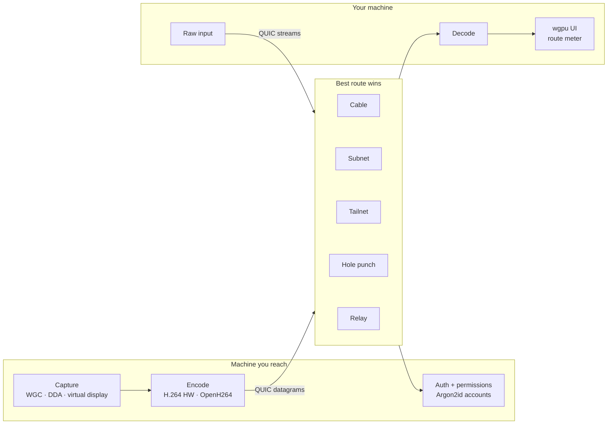

<p align="center">
  
</p>

<p align="center">
  <h1 align="center">Pravera</h1>
</p>

<h2 align="center">Stop routing your screen through someone else's cloud.</h2>

<p align="center">
  <strong>The open-source remote desktop that finds the fastest path between your machines and shows it to you.<br />
  Free. No account. No subscription. No middleman.</strong>
</p>

<p align="center">
  A cable on your desk, the same Wi-Fi, a tailnet, a hole punched straight through two NATs. Pravera tries every route it knows,
  puts your session on the quickest one, and draws that route live in the title bar so you always know <em>why</em> it feels the way it does.
</p>

<p align="center">
  <a href="https://github.com/n1ssyyy/Pravera/releases/latest"><strong>⬇ Download for Windows · macOS · Linux</strong></a>
</p>

<p align="center">
  <a href="https://github.com/n1ssyyy/Pravera/actions/workflows/ci.yml">
    
  </a>
  <a href="https://github.com/n1ssyyy/Pravera/releases/latest">
    
  </a>
  <a href="#-license">
    
  </a>
</p>

<p align="center">
  
  
  
  
  
</p>

<p align="center">
  <a href="https://github.com/n1ssyyy"></a>
</p>

---

<h3 align="center">No vendor account. No monthly seat. No "commercial use detected". No mystery lag.</h3>

<p align="center">
  The big remote desktops broker every session through <em>their</em> servers, bill you monthly for unattended access and
  never tell you which way your pixels went.<br />
  Pravera connects the two machines directly, lets the machine you connect <em>to</em> decide who gets in, and shows you the path.
</p>

## 🥊 How it stacks up

| | **Pravera** | TeamViewer | AnyDesk | RustDesk | Parsec | Chrome RD | Windows RDP |
|---|:-:|:-:|:-:|:-:|:-:|:-:|:-:|
| Price | **Free** | ~$24.90 / mo, billed yearly | from €19.90 / mo, billed yearly | free · Pro $11.88 / mo | free · Warp $8.33 / mo | free | in Windows Pro |
| Free for work use | ✅ | ❌ personal only, "commercial use suspected" | ❌ personal only | ✅ | ❌ Teams from $30 / mo | ✅ | ✅ |
| Open source | ✅ MIT / Apache-2.0 | ❌ | ❌ | ✅ AGPL-3.0 | ❌ | ❌ | ❌ |
| Vendor account required | **no** | yes | ? | no | yes | yes, Google | no |
| Across the internet, no port forwarding | ✅ | ✅ | ✅ | ✅ | ✅ | ✅ | ❌ VPN or RD Gateway |
| Shows you the route it took | ✅ live, every hop | — | — | — | — | — | — |
| Reach a PC before anyone signs in | ✅ free | ✅ | ✅ | ✅ | ✅ | ? | ✅ Pro hosts only |
| Can be hosted on | Windows | Windows · macOS · Linux | Windows · macOS · Linux | Windows · macOS · Linux | Windows · macOS | Windows · macOS · Linux | Windows Pro / Enterprise |
| AI agent control (MCP) | ✅ opt-in, loopback | — | — | — | — | — | — |

<sub>From the official pricing pages and docs on 2026-09-29: <a href="https://www.teamviewer.com/en/global/support/knowledge-base/teamviewer-classic/licensing/personal-use/commercial-use-suspected/">TeamViewer</a> (price is a third-party figure; the official page wouldn't render it) · <a href="https://anydesk.com/en/pricing">AnyDesk</a> (EU pricing, before VAT) · <a href="https://rustdesk.com/pricing">RustDesk</a> · <a href="https://parsec.app/pricing">Parsec</a> · <a href="https://support.google.com/chrome/answer/1649523">Chrome Remote Desktop</a> · <a href="https://learn.microsoft.com/en-us/windows-server/remote/remote-desktop-services/remotepc/remote-desktop-supported-config">RDP</a> (Windows Home can't host). — = not offered or not documented, ? = couldn't verify. To punch through NATs, and as a last resort, Pravera uses <a href="https://github.com/n0-computer/iroh">iroh</a>'s public relays; the session is end-to-end encrypted either way. Something out of date? Open an issue and we'll fix it.</sub>

## ⚡ What it does

- 🛣️ **Takes the fastest road, automatically.** Thunderbolt, USB4 or Ethernet between two machines beats any Wi-Fi. The local subnet beats any tunnel. A hole-punched direct link beats any relay. Pravera measures every route it knows, puts the session on the best one, and falls down that list live when the network changes.
- 🗺️ **Shows you the route.** Every session draws its own path (cable, subnet, tailnet, punched tunnel or relay) with the measured quality of each hop. If it ever has to use a relay, the route meter says so in plain words.
- 🎥 **Pixels that keep up.** Hardware H.264 when the GPU offers it, a software encoder when it doesn't, same protocol either way. Frames ride unreliable datagrams with keyframe recovery, so a lost packet costs one frame instead of a frozen picture.
- 🖱️ **Input at your mouse's own rate.** Raw, uncoalesced hook input, not a polling loop. Alt+F4, Win key and the other system chords land on the far machine, not yours.
- 🔊 **Everything else, on the same connection.** System audio, a clipboard that arrives as you copy, and files that drag straight into a live session with no second handshake.
- 🗂️ **Several machines, one window.** Each session is a tab. So is each remote terminal.
- 💻 **A real remote terminal.** ConPTY on the host and Pravera's own VT emulator on your side (truecolor, 256 colours), over the same encrypted transport. Open a shell on a box with no picture at all.
- 🌙 **Reach a machine nobody is sitting at.** A Windows service starts Pravera on the console before anyone signs in. Reboot a headless box, sign in from across the world. `Send Ctrl+Alt+Del` works, and so do UAC prompts and the lock screen (Desktop Duplication takes over where the normal capture is refused).
- 🖥️ **No monitor? No problem.** A bundled virtual display driver gives a headless box a real 1920×1080 screen to host.
- 🔐 **The host holds the keys.** Accounts, roles and per-permission grants (view, control, clipboard, files, audio, elevation) live on the machine being reached, passwords hashed with Argon2id. The client is the part an attacker controls, so it is trusted with nothing the host didn't grant.
- 🤖 **Let an AI agent drive, if you want.** Flip one switch and a local agent can operate the machine through a loopback-only MCP tool bus: pointer, keyboard, clipboard, files. Off by default, loopback only, every tool listed and labelled on screen.
- 🎮 **Gaming mode.** Fullscreen on the far monitor, cursor locked to the window, system chords captured instead of stolen.
- 🔄 **Keeps itself current.** Pravera checks for a new release every few hours, verifies its size and SHA-256 digest, and swaps itself in only when nobody is using it. Never mid-session.

## 📥 Get it

Grab the **Pravera Setup** for your machine from the [latest release](https://github.com/n1ssyyy/Pravera/releases/latest). It's one file with the whole app inside, installs for your user only and never asks for admin.

| System | Download | Role |
|---|---|---|
| 🪟 Windows 10/11 (x64) | `Pravera-Setup-Windows-x64.exe` | Connect **and** host |
| 🍎 macOS (Apple Silicon) | `Pravera-Setup-macOS-arm64.zip` → unzip → open **Pravera Setup** | Connect |
| 🐧 Linux x86_64 (Ubuntu 22.04+, Fedora 36+, Debian 12+) | `Pravera-Setup-Linux-x86_64.AppImage` → `chmod +x` → run | Connect |

Run the same Setup again any time to update, repair or uninstall. Once it's installed, Pravera updates itself.

> The installers aren't code-signed yet: on Windows hit **More info → Run anyway**, on macOS **System Settings → Privacy & Security → Open Anyway**. No FUSE on your Linux box? Run the AppImage with `--appimage-extract-and-run`.

**First run.** The machine you want to reach asks you to create a host account, and shows its device ID (`PRV-XXXX-XXXX`). On the other machine, type that ID, sign in with that account, and you're in. Machines on the same network or tailnet show up on their own.

**Scripted installs.** Every Setup takes the same flags:

```bash
Pravera-Setup-Windows-x64.exe --quiet                       # install for this user, then launch
Pravera-Setup-Windows-x64.exe --quiet --no-launch --dir D:\Apps\Pravera --desktop-shortcut
Pravera-Setup-Windows-x64.exe --quiet --uninstall --purge   # remove it, and its settings too
```

## 🧬 Under the hood



One executable plays every part: the app, the host, the Windows service, the installer and the updater. The transport is [iroh](https://github.com/n0-computer/iroh) (QUIC with end-to-end encryption and NAT hole-punching); pictures travel as datagrams, input, clipboard, files and terminals as streams. The UI is [iced](https://github.com/iced-rs/iced) on wgpu, drawn on the GPU.

| Crate | Job |
|---|---|
| `pravera-ui` | The app: every screen, the installer, the updater |
| `pravera-transport` · `pravera-discovery` | QUIC endpoint, route racing, subnet / mDNS / Tailscale discovery |
| `pravera-host` · `pravera-client` | The two ends of a session |
| `pravera-capture` · `pravera-codec` · `pravera-input` · `pravera-audio` | Screen, encode / decode, input injection, sound |
| `pravera-auth` · `pravera-crypto` | Accounts, roles, permissions, device identity |
| `pravera-files` · `pravera-term` · `pravera-mcp` | File transfer, terminal emulator, the agent bus |
| `pravera-service` | The Windows service that hosts before sign-in |

**Built with** Rust · iced · wgpu · iroh · OpenH264 · Media Foundation · Windows Graphics Capture · Argon2id · tokio

## 🛠 Hack on it

You'll need Rust stable (1.85+). Windows needs nothing else. Linux wants `pkg-config libasound2-dev libxkbcommon-dev`.

```bash
git clone https://github.com/n1ssyyy/Pravera.git && cd Pravera
cargo run -p pravera-ui              # the app
cargo test --workspace               # the test suite is the specification
```

The binary is `pravera`. Rename it to anything with `setup` in the name, or pass `--setup`, and it becomes the installer.

## ⚙️ Tune it

Everything lives in the app's **Settings**: host accounts and permissions, start at sign-in, host at launch, the Windows service, displays, the agent bus and automatic updates. For debugging:

| Variable | What it does |
|---|---|
| `RUST_LOG` | Log filter, e.g. `pravera=debug`. The log lives in the app's data folder as `pravera.log`. |
| `PRAVERA_PREVIEW` | Dev builds: open the UI beside your real Pravera, with no networking and nothing written to disk. |
| `PRAVERA_UPDATE_FROM` | Dev builds: pretend to be this version, to exercise the updater. |

## 🚢 Ship it

Every push to `main` is built, tested, installed and uninstalled on Windows, macOS and Linux. Tag it and CI publishes exactly three files, one Setup per platform with the app inside.

```bash
git tag v0.1.0 && git push origin v0.1.0   # must match the version in Cargo.toml
```

Installed copies pick the new release up on their own.

## 🩺 Something off?

| Problem | Fix |
|---|---|
| Connected, but no picture | Check the host's log (`pravera.log` in its data folder). On a machine with no monitor, add the virtual display from **Settings → Displays**. |
| Can't reach a machine before sign-in | Turn on the **Windows service** in the host's Settings (it asks for admin once). |
| The route says **Relay** | The two machines couldn't reach each other directly. A shared network, a tailnet or a cable puts them on a direct path. |
| Windows says "Windows protected your PC" | The installer isn't signed yet: **More info → Run anyway**. |
| macOS says it can't be opened | **System Settings → Privacy & Security → Open Anyway**. |
| Linux Setup won't open | Your system has no FUSE. Run it with `--appimage-extract-and-run`. |

**Honestly not done yet.** This project names its unbuilt parts instead of hiding them: hosting is Windows-only today (macOS and Linux connect but can't be reached yet), and removing or renaming virtual displays is still done in the driver's own tool.

## 📄 License

Dual-licensed under [MIT](LICENSE-MIT) or [Apache-2.0](LICENSE-APACHE), at your option. Fork it, ship it, host it. Your screen stays between your machines.

## 🙏 Acknowledgements

Developed by [n1ssyyy](https://github.com/n1ssyyy).

Powered by [iced](https://github.com/iced-rs/iced) · [wgpu](https://github.com/gfx-rs/wgpu) · [iroh](https://github.com/n0-computer/iroh) · [OpenH264](https://github.com/cisco/openh264) · [windows-capture](https://github.com/NiiightmareXD/windows-capture) · [Virtual Display Driver](https://github.com/VirtualDrivers/Virtual-Display-Driver) (MIT) · tokio · Argon2.
